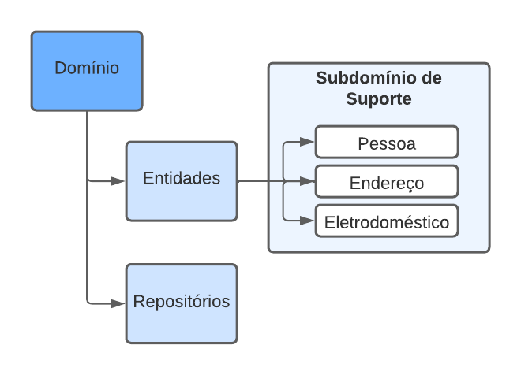

# Intelligrid: Relatório Técnico 01

Intelligrid é um sistema para monitoramento de consumo de energia de equipamentos. Nesta primeira fase, estabelecemos nossa fundação, definindo as três primeiras entidades da camada de domínio: Pessoa, Endereço e Eletrodoméstico. Em sequência, criamos a controladora e as classes de serviço para implantar um CRUD (*create, read, update, delete*) básico para as entidades. Por fim, anotamos as variáveis de classe para permitir a validação de dados e fizemos tratamentos das exceções por meio de um *Handler*.

## Objetivos

O principal objetivo deste relatório é discursar sobre a implementação da primeira fase do projeto.

Como objetivos específicos:

- Apresentar a estrutura e arquitetura;

- Discutir sobre escolhas realizadas e desafios encontrados.

## Desenvolvimento

### Tecnologias e Ferramentas

Configuramos um projeto utilizando a *stack* Java 17, *Spring Boot* 3 e a interface JPA (*Java Persistence API*) combinada com um banco de dados em memória H2 para persistência. Adicionamos também a dependência *Lombok*, para facilitar a criação de *Getters*, *Setters* e construtores.

Para versionamento estamos utilizando Git em combinação com a plataforma Github para orquestrar a colaboração dos esforços do time e para gerenciamento de dependências do projeto utilizamos o Maven. Os membros do grupo estão trabalhando com suas IDEs preferência, seja IntelliJ, Eclipse ou VS Code. Dessa forma, foi implementado o arquivo `.gitignore` para não permitir o compartilhamento de configurações desses editores ao repositório do projeto.

Também consumimos uma API externa, a Viacep, para auxiliar na obtenção de dados de endereço no território brasileiro. Para realizar e processar a requisição utilizamos a interface *WebClient*, disponível no *Spring*.

Por fim, para gerenciar nossa biblioteca de requisições, realização de testes e documentação da API, utilizamos a ferramenta *Postman*.

### Arquitetura

Em nossa arquitetura, adotamos os padrões de Domain Driven Design (DDD) e 
Representational State Transfer (REST), promovendo uma estrutura eficiente e clara. 
No DDD, a camada de domínio assume a administração das entidades inerentes às regras de negócio.

Em paralelo, a camada de serviço é encarregada de implantar essas regras de negócio, 
concentrando a complexidade concentrada neste ponto, o que contribui para a robustez do nosso sistema.

Já a camada controladora tem a função de lidar com as requisições recebidas, 
bem como retornar as respostas adequadas para o cliente. Dessa maneira, 
conseguimos manter a responsabilidade da camada controladora mais enxuta e com foco estrito em sua função.

Essa distribuição de responsabilidades assegura a manutenção de um código mais limpo e organizado, 
além de possibilitar um gerenciamento mais eficaz da complexidade na camada de serviço.

### Camada de Domínio

Neste primeiro momento, foram implementadas três entidades do **subdomínio de suporte** relativas ao cadastro de informações no sistema: Pessoa, Endereço e Eletrodoméstico. Além das entidades, também temos classes auxiliares de repositórios, responsáveis pela persistência de dados.

Fig. 1: Camada de Domínio

Fonte: Produção dos autores, 2023.

 

As seguintes entidades do subdomínio de suporte foram criadas:

- Pessoa: representa um usuário do sistema e gerencia informações como Nome, Data de Nascimento, Gênero, etc.

- Endereço: gerencia a informação de endereços cadastrados no sistema, como: Rua, Número, Bairro, Cidade e Estado.

- Eletrodoméstico: trata dos dados sobre eletrodomésticos cadastrados, por exemplo: Nome, Modelo, Potência, entre outros.

### Camadas de Controladora e Serviço

Seguindo os recomendações de separação de funcionalidade, a camada de controladora possui os métodos da API responsáveis pela interface, enquanto da camada de serviço implementa as regras de negócio. Nesta fase do projeto, ambas as camadas foram responsáveis pela implementação do CRUD das entidades.

Em nossa implementação a camada da controladora ficou responsável pela especificação dos endpoints e implantação do CRUD seguindo os preceitos do REST, como utilização dos verbos do protocolo HTML e a não persistência de estado entre as requisições.

Por questões de organização os DTOs foram organizados entre request e response dentro da camada da controladora.

Neste momento, todos os métodos de exclusão implementados efetivamente deletam os registros da base de dados, não foi implementada no presente momento nenhuma forma de *soft delete*.

## Discussões

Nesta seção, iremos abordar alguns pontos de destaque no desenvolvimento desta primeira fase:

- Persistência: JPA e Banco de dados H2;

- Validação de dados: expansão das anotações para CEP e e-mail utilizando Regex;

- Tratamento de Exceções e Handler;

- Consumo de API externa Viacep e webclient.

### Persistência de dados

Neste primeiro momento, mesmo não sendo necessária persistência de dados, optamos pelo uso da interface JPA em conjunto com o banco de dados H2. Dessa forma, não foi necessária a criação de códigos e outras estruturas de dados em memória para testar o funcionamento de nossas funcionalidades enquanto em desenvolvimento.

O uso dessa estratégia também propicia as seguintes vantagens:

- Possibilidade de alteração transparente do banco de dados no futuro, uma vez que JPA é uma API;

- Mapeamento das entidades diretamente como tabelas do banco de dados;

- A nomenclatura padrão de métodos do JPA nos permitiu executar as operações no banco sem a necessidade de criação de queries SQL.

### Validações de dados

A primeira validação dos dados ocorre na tentativa de conversão dos dados provenientes das requests para os Objetos Java, como por exemplo para um `Double` ou `LocalDate`. No caso da impossibilidade de conversão, uma exceção é lançada.

Adicionalmente, também utilizamos as anotações de validação do *framework Jakarta* nas variáveis dos DTOs. Dessa forma, conseguimos especificar se uma variável deve ou não ser nula, estar em branco ou no caso de datas se devem ser passadas ou futuras. No caso de um dado não passar na validação, também ocorre o lançamento de uma exceção.

Além de deixar o código mais "limpo", também foi possível customizar e criar anotações para atender nossas necessidades. Adaptamos a anotação `@Email` para que validasse as informações contra um *regex* que fornecemos, ao invés do comportamento padrão para que o formato do endereço de e-mail aceito fosse mais robusto. Além disso, criamos a anotação `@CEP` para validar a recepção desse dado na estrutura `00000-000`, onde os dígitos `0` representam caracteres numéricos.

### Tratamento de Exceções

Para o tratamento de exceções, optamos por utilizar um *Handler* para capturar as exceções lançadas e retornar uma resposta padronizada para o cliente. Dessa forma, não é necessário tratar as exceções em cada método da controladora, o que torna o código mais limpo e legível.
E para padronizarmos o retorno dos erros na API criamos um DTO responsável por encapsular e padronizar esses retornos, chamamos ele de ErrorResponse

### Consumo de API externa

Para o consumo da API externa, utilizamos a interface *WebClient* disponível no *Spring*. Essa interface nos permite realizar requisições HTTP de forma assíncrona, o que é interessante para evitar que a aplicação fique bloqueada enquanto aguarda a resposta da requisição. Além disso, o *WebClient* também nos permite realizar o mapeamento dos dados recebidos para objetos Java, o que facilita o uso dos dados recebidos.
Estamos utilizando como API externa o [Via Cep](https://viacep.com.br/), que nos permite obter dados de endereços brasileiros a partir de um CEP.

## Considerações Finais

Então podemos afirmar que a primeira fase do projeto foi concluída com sucesso. 
A implementação das funcionalidades foi realizada de forma satisfatória, 
e os objetivos propostos foram alcançados. 
Além disso, a equipe conseguiu superar os desafios encontrados durante o desenvolvimento, 
tais como a implementação do Handler Exception e do Via CEP, 
o que contribuiu para o aprendizado de todos os membros do grupo.
