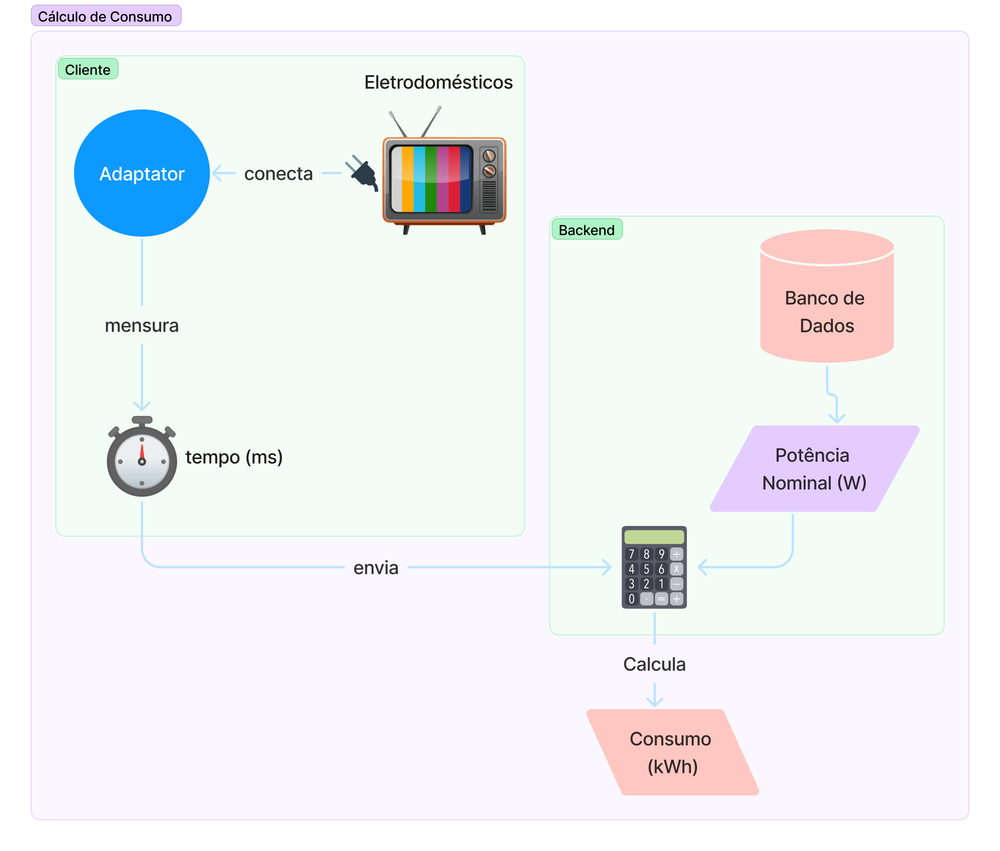
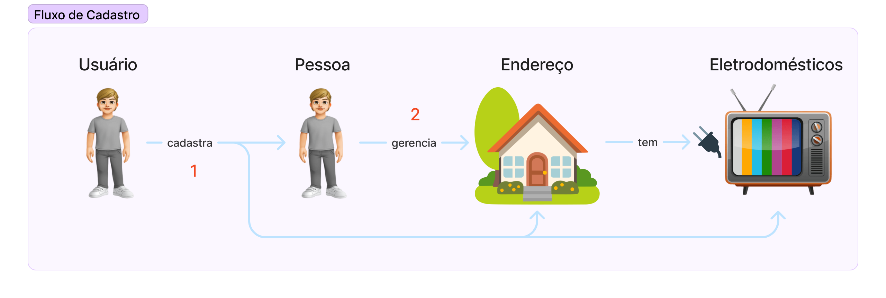
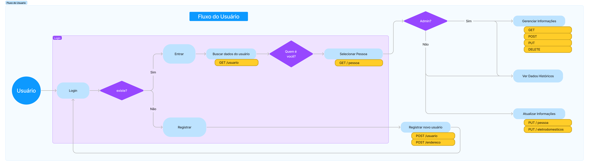
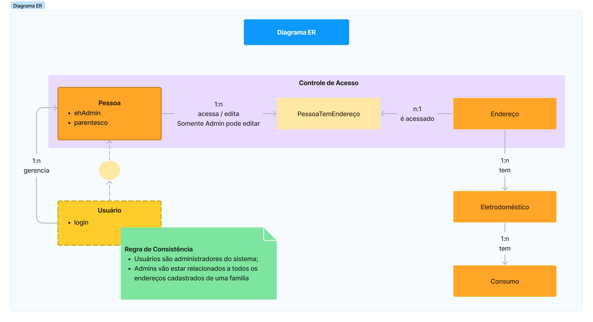

# Intelligrid: Relatório Técnico 02

Intelligrid é um sistema para monitoramento de consumo de energia de equipamentos. Nesta segunda fase, ampliamos o escopo das entidades de domínio anteriormente criadas (Pessoa, Endereço e Eletrodoméstico) com a adição de buscas e o estabelecimento de relacionamentos em banco de dados. Além disso, criamos mais duas entidade: Usuário e Consumo. A primeira é uma especilização do tipo `Pessoa` sendo responsável pelo gerenciamento das mesmas, enquanto a segunda registrará os consumos dos eletrodmésticos.

## Objetivos

O principal objetivo deste relatório é discursar sobre a implementação da segunda fase do projeto.

Como objetivos específicos:

- Apresentar a estrutura e arquitetura;

- Discutir sobre escolhas realizadas e desafios encontrados.

## Desenvolvimento

### Tecnologias e Ferramentas

O projeto utiliza a *stack* Java 17, *Spring Boot* 3 e a interface JPA (*Java Persistence API*) combinada com um banco de dados em memória H2 para persistência. 

Adicionalmente também foram utilizadas as seguintes ferramentas:

- A biblioteca *Lombok* para facilitar a criação de *Getters*, *Setters* e construtores;

- O Maven para gerenciamento de dependências;

- Git em combinação com o Github para versionamento e gerenciamento do projeto;

- Os membros do grupo estão trabalhando com suas IDEs de preferência, seja IntelliJ, Eclipse ou VS Code. Dessa forma, ao estabelecer o versionamento, implementamos o arquivo `.gitignore` para não permitir o compartilhamento de configurações desses editores ao repositório do projeto.

- Também consumimos uma API externa, a Viacep, para auxiliar na obtenção de dados de endereço no território brasileiro. Para realizar e processar a requisição utilizamos a interface *WebClient*, disponível no *Spring*.

- Por fim, para gerenciar nossa biblioteca de requisições, realização de testes e documentação da API, utilizamos a ferramenta *Postman*.

### Narrativas de Domínio

Com base em Event Storming, identificamos os comandos geradores de eventos e seus respectivos atores que promovem a execução. A partir dessas informações, criamos as narrativas que descrevem os fluxos da aplicação (*Domain Storytelling*).

O primeiro diagrama (Figura 1) descreve em alto nível o funcionamento de nosso produto, representando como será realizada a medição e o cálculo do consumo. Nesta história, temos que nossos adaptadores se conectam aos eletrodomésticos do cliente e fazem a medição do tempo de utilização e seu envio ao *backend*, a partir das informações já cadastradas em banco de dados da potência nominal dos equipamentos, conseguimos realizar o cálculo da estimativa de consumo.

Fig. 1: Fluxo do Produto e Cálculo de Consumo

Fonte: Produção dos autores, 2023.

 

O próximo fluxo representa o comportamento dos atores, figura 2. No qual, haverá um usuário responsável pela administração do sistema e que terá permissões para executar as atividades de cadastro de pessoas ligadas ao seu fluxo familiar, eletrodomésticos e os endereços aos quais se encontram. Além disso, essas outras pessoas podem gerenciar alguns aspectos dos objetos como a atualização de informações e a visualização de dados históricos de consumo.

Fig. 2: Fluxo de Cadastro

Fonte: Produção dos autores, 2023.

 

Por fim, conceitualizamos o fluxo do usuário na aplicação e os acessos que serão realizados em nossa API. Neste temos que a entrada do processo é o login, caso não seja bem sucedido, o usuário terá a opção de se registrar. Em caso de sucesso, a aplicação o redirecioará para a escolha do perfil, em que ele irá se identificar como uma das pessoas cadastradas no sistema. Em caso de ser um administrador, ele poderá efetuar cadastros, atualizações e visualização de todos os dados de seu núcleo familiar.

Fig. 3: Fluxo do Usuário

Fonte: Produção dos autores, 2023.

 

### Banco de dados e Relacionamentos

Nesta fase, foi solicitada a inclusão de relacionamentos nas três entidades anteriormente criadas: Pessoa, Endereço e Eletrodoméstico. Além destas, também adicionamos as classes Usuário e Consumo, que serão responsáveis pelo gerenciamento das pessoas e do monitoramento dos eletrodomésticos, respectivamente. A partir das histórias e fluxos montados, criamos o diagrama de Entidade-Relacionamento da Figura 4 para descrever a estrutura do banco de dados.

Fig. 4: Diagrama Entidade-Relacionamento

Fonte: Produção dos autores, 2023.

 

Os pontos de destaque da estrutura acima são o relacionamento N:N entre Pessoa e Endereço e a especialização de **Pessoa** em **Usuário**. O primeiro foi escolhido pois tratamos o cadastro de pessoas como perfis de acesso, em que uma pessoa pode acompanha as informações de mais de um endereço. Por sua vez, optamos por especializar o **Usuário** a partir da entidade **Pessoa** para aumentar o desafio técnico da implementação.

## Discussões

Nesta seção, iremos abordar alguns pontos de destaque no desenvolvimento desta primeira fase:

- Linguagem ubíqua e pictografica
- Integração Contínua
- Persistência de dados e Relacionamento
- Validações de dados e Tratamento de Exceções

### Linguagem ubíqua e pictografica

Durante o desenvolvimento dos diagramas e códigos, nos atentamos ao uso das linguagens pictográficas e ubíqua em suas confecções. Com relação à primeira, foram criados representações narrando eventos e fluxos da aplicação (os quais estão apresentados acima). Já a segunda, consistiu na utilização de termos relacionados à regra de negócio na definição de variáveis, métodos e entidades. Além disso, também se trata da consistência na utilização de termos para garantir o entendimento sem ambíguidades, por exemplo, são utilizados os termos adicionar e excluir para se referir a persistência de registros no banco de dados, enquanto os termos incluir e remover são relativos aos relacionamentos entre registros.

### Integração Contínua

Para nos auxiliar no projeto, configuramos o *circle CI* para realizar a integração contínua (*continuous integration*). Tal processo facilita a execução de testes da aplicação a cada *merge* para a *branch* principal.

### Persistência de dados e Relacionamento

Desde a fase anterior já havíamos optado pela utilização da interface JPA em conjunto com o banco de dados H2. Este banco de dados será utilizado durante o desenvolvimento da aplicação, mas a utilização do JPA nos possibilita a transição de forma simplificada para bancos de dados mais robustos futuramente.

### Validações de dados e Tratamento de Exceções

As estruturas de validações de dados e de tratamento de exceções já haviam sido estabelecidas na fase anterior, a partir de anotações do *Jakarta* e da utilização de *handler*, respectivamente. Dessa forma, foi realizadas apenas adições de novas exceções para lançamento e de configuração de atributos a serem validados em DTOs e métodos.

## Considerações Finais

Nesta fase trabalhamos no entendimento e descrição dos fluxos da aplicação, narrando as histórias e utilizando as linguagens pictográfica e ubíqua.

Durante a implementação dos relacionamentos, enfrentamos algumas dificuldades com as respostas das requisições que estavam em referência cíclica. Para solucionar tais impedimentos, utilizamos as anotações `@JsonBackReference` e `@JsonManagedReference`, e em alguns casos também o emprego de DTOs nos retornos de listas.

